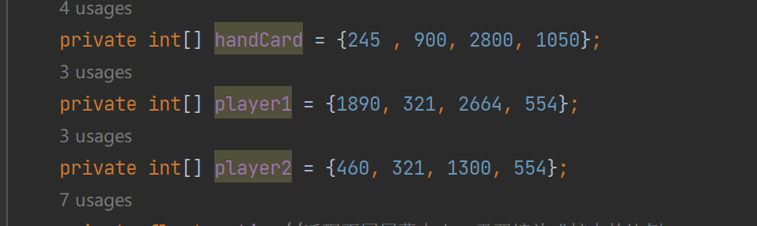

## 基于安卓opencv实现的欢乐斗地主记牌器

### 使用效果图
停止后面显示的信息分别为玩家一的出牌区域识别的点数，玩家二的点数，以及一个时间（每次识别屏幕一次都会更新一次，单位为s）

### 安装与使用

安装好应用程序以后，点击打开，此时会申请开启悬浮窗权限，以及录屏权限，同意即可。

到达游戏界面，等待发牌以后点击开始，此时程序会初始化，记牌器的数量就是全部牌数量减去自己手牌的数量，只有在初始化时才会减去手牌的数量，所以需要在每次游戏开始时，都需要点击开始按钮。可以看到，记牌器的数量就是减去手牌数量以后的牌数。

程序的运行逻辑大致如下：

1.开始时识别手牌区域，记牌器显示手牌外还剩余多少牌。

2.每间隔1.5s（该时间可以设置）获取一次屏幕截图，识别玩家一和玩家二的出牌区域点数，如果当前时间和上次时间的点数相同，就不更新记牌器，如果不同，说明该玩家出了新的牌，那么更新记牌器。程序识别牌点数需要耗费一定时间，所以记牌器显示的时间间隔一定是大于1.5s的。

此程序使用的是opecv的模板匹配进行识别牌名的，所以涉及到像素操作，在某些尺寸的手机上面运行可能会出错（虽然程序做了不同屏幕的适配），可以自行修改项目里面的出牌区域或者每一个点数的截图。在手机屏幕为3200x1440和2400x1080上面运行是没有问题的。

